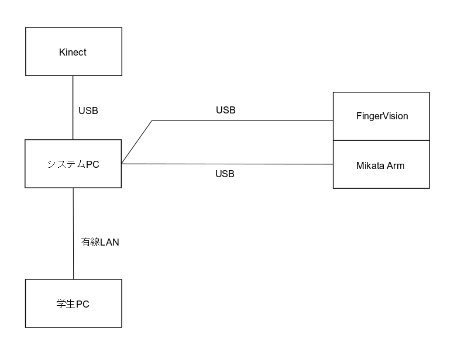

# 触覚と3次元視覚を備えたロボットアームのためのプログラミング教材（RTミドルウェアコンテスト2019応募作品）

大阪電気通信大学  
澤﨑 悠太，升谷 保博  
2019年11月25日

## 概要

センサやアクチュエータをRTCとしてモジュール化し，それらを組み合わせ方や，統合するモジュールの
プログラムを学習する教材を開発した．ロボットアームは，ROBOTIS社のアクチュエータDynamixelで構成された
ものを想定している．また，センサは，深度カメラと触覚センサを想定している．Dynamixel汎用のRTCと
深度カメラから3次元点群データを出力するRTCは，著者らの研究室がGitHubで公開しているものを再利用する．
触覚センサとしてFingerVisionを導入し，そのためのRTCを新たに開発した．
初学者でもセンサやアームの入出力を使いやすくなるように中継役のRTCを用意した．
最終的に，この教材を用いて触覚センサと3次元視覚の両方を使って複数の円柱の把持と運搬ができるように，課題を設定する．
  
  本リポジトリの内容は，[RTミドルウェアコンテスト2019](https://openrtm.org/openrtm/ja/content/rtmcontest2019)にエントリしている[作品](https://openrtm.org/openrtm/ja/node/6919)である．

## 特徴

- 触覚と3次元視覚を備えたロボットアームの制御を行うコンポーネント群
- 限られた授業時間の中でロボットアームのシステムインテグレーションのソフトウェア面を効果的に学習させる狙いがあり，センサの情報に応じてロボットにタスクを遂行させるプログラムの作成を主題としている．
- ロボットの多数の要素を経験的に知り，より深い学習への動機付けとする狙いもある．
- ロボットプログラミングの教材として，RTミドルウェアの知識のない受講者が，このコンポーネントの一部のコードを書いて実習する．
- 種類の異なる複数のセンサの役割や使い分けを学ぶ
- RTミドルウェアのプログラミングの知識がなくても，Arduinoの感覚でプログラムを書くことができる．
- RTミドルウェアのネットワーク透過性の利用
  - 教材のハードウェアは提供側が用意するPC（システムPC）に接続，受講者のPC（学生PC）はネットワークにさえ繋げば良い．
  - ハードウェア関係のコンポーネントは全てシステムPCで動かし，受講生が自作するコンポーネントだけを学生PCで動かし，両者を接続する．
- RTミドルウェアのモジュール性の利用
  - ハードウェアの入れ替え(例：KinectをRealSenseに置き換える)や追加が容易
  - 教材の変更や拡張が容易

## 環境

- RTミドルウェア: OpenRTM-aist 1.2.0 64bit版
- OS: Windows 8.1/10 64bit
- 開発環境: Visual Studio 2015
- 言語: C++, Python

 

## 必要なハードウェア

- PC(2台)
- FingerVision(2個)
- Microsoft Kinect v2
- MikataArm（Dynamixel XM430 5個利用，4関節＋グリッパ）

## 必要なソフトウェア

- 教材を準備する側
  - OpenRTM-aist 1.2.0
  - OpenCV 2.4.13.6, 3.4
  - Python 3.7.3
  - numpy 1.17.0
  - Eigen 3.3.7
  - Boost 1.69
  - Point Cloud Library 1.8.1 AllinOne(VS2015 64bit用)
  - Kinect for Windows SDK v2.0
  - DynamixelSDK 3.7
  - CMake 3.13

- 受講生側
  - OpenRTM-aist 1.2.0
  - CMake 3.13

 

## コンポーネント

以下に教材で使用するRTCを紹介する．(接続図は右図を参考)

### [FingerVisionCore](https://github.com/MasutaniLab/FingerVisionCore/tree/6a933b061d1c4ed361ac6b041bcffeff0eacd20f)
- 触覚センサFingerVisionでは，マーカーの位置やオブジェクトの位置等の情報を出力するRTコンポーネント．
  - FingerVisionはセンサ部分にマーカーが埋め込まれており，キャリブレーション時のマーカー位置と現在のマーカーの位置の差を見ている．
- FingerVisionから得られた画像は，以下のデータに変換して出力される．
    - 各マーカーの座標，マーカーサイズ，変動後のマーカー座標，変動後のマーカーサイズ．
    - オブジェクト空間モーメント，中心モーメント，中央正規化モーメント．

### [FingerVisionFilter](https://github.com/MasutaniLab/FingerVisionFilter/tree/fb83da8d3495a00795814bd9b26c9caf20dab135)

- 入力されたFingerVisionCoreからの情報を扱いやすいように変換して出力するRTコンポーネント．
- FignerVisionCoreから入力されたマーカーの座標情報等を基に，以下のデータを出力する．
  - 各マーカーごとの 座標(x,y,z), 力の成分(x,y,z)，トルク(x,y,z)
  - 全マーカーの 力の成分の平均(x,y,z)，トルクの平均(x,y,z)
  - オブジェクトの位置，向き，中心位置，3×3で分けられたスリップの配列(スリップ分布)，オブジェクトの位置を格納する配列と，オブジェクトの中心位置(x,y)(センサフレーム上の位置)，オブジェクトの向きの角速度等．

### [MikataArmController](https://github.com/MasutaniLab/MikataArmController/tree/df2ed816a8344706b076b836b0eaf527d785c1df)

- 触覚と3次元視覚を備えたロボットアームの制御用RTコンポーネント．ロボットプログラミングの教材として，RTミドルウェアの知識のない受講者が，このコンポーネントの一部のコードを書いて実習する．
- 受講者が自由に編集するソースファイルを全体から分離している．practice.cpp内で#includeするファイルを変更することによってソースファイルを切り替えられる．これによって，コンポーネント名は同じままで，様々なコードを試すことが可能．
- PCToColotrCylinderから単体または複数の円柱の座標，半径，色相の情報を受け取る．このコンポーネントでは単体または複数の円柱情報を利用して，手先位置指令を確定する．
- 円柱の把持にはFingerVisionFilterからセンサに掛かっている力の平均の情報を利用して把持できたかを判定する．
- 入力されたMikataArmWrapperからの値でロボットアームの状態を判断しており，値にはビットごとに意味を持たせている．
- 出力である手先位置指令はx,y,z座標，pitch，ハンドの開閉，動作時間[sec]を設定する．

### [Kinect2ToPC](https://github.com/MasutaniLab/Kinect2ToPC/tree/607f3982c0fdfec133896ef9ccbcba762e14bf86)

- Kinect v2から深度と色の情報を読み取り，色付き点群データを出力するRTコンポーネント．
  - 出力する点群を表す座標系は，x軸は右向きが正，z軸は後ろ向きが正(それぞれKinectの座標系と逆向き，y軸はどちらも上向きが正)．

### [PCToColorCylinder](https://github.com/MasutaniLab/PCToColorCylinder/tree/14ca9ab3ea4d257095536680299b39a7cd1d9c19)

- 入力された色付き点群データから，平面上の単体もしくは複数の円柱の位置，半径，色情報を出力するRTコンポーネント．
- 抽出された円柱は一定回数以上ほぼ同じデータを示したものを選び，その平均を基本座標系に変換して出力している．
  - 出力する点群を表す座標系は，x軸は前向きが正，y軸は左向きが正，z軸は上向きが正．

### [MikataArmWrapper](https://github.com/MasutaniLab/MikataArmWrapper/tree/59121cdb4d53e0301e271ecfaaed31b1743f373d)

- 入力された手先位置指令や関節角度指令から，各Dynamixelの内部表現の角度と速度に変換した値をDynamixelに出力するRTコンポーネント．
  - 現在位置から指令位置に動作する際に，全ての関節が同じ時間で動作が完了するように速度指令を与えている．
- Dynamixelの入力から動作中であるか等の情報をMikataArmControllerに出力する．

### [Dynamixel](https://github.com/MasutaniLab/Dynamixel/tree/8aa2c5906a1f80eee36817084177b145c73821da)

- 入力された位置と速度の指令をアクチュエータへ送ったり，アクチェータから取得した現在位置を出力するRTコンポーネント
- 入力として，アームを構成する各Dynamixelの内部表現の角度と速度を受け取る．
- アクチェータから取得した現在位置を出力する．

## 問題設定と課題案

この教材でアームが扱う対象は，机の上に垂直に置かれた円柱に限定する．
ただし，円柱の位置・寸法・色・重量・変形のしやすさは多様であるとし，これらに対応することを課題とする．
  
  以下に全てのセンサを用いてアームの制御をする課題案を示す．この課題はMikataArmControllerのexample5.cppファイルと対応している．
- 課題案
  - 3～5種類のそれぞれ重さ、半径や高さ，色が違う円柱をアームの周辺にその場で配置を決めて並べる．赤色の円柱は(x, y) = (-0.05[m], 0.10[m])に置き，青色の円柱は(x, y) = (-0.05[m], -0.10[m])に置け．それ以外の色の円柱は(x, y) =(-0.10[m], 0.0[m]) に設置せよ．また，円柱を落としたりつぶしたりせずに適切に分別せよ．
  - 狙い: 全てのセンサ情報を活用したロボットアームの制御を習得してもらう．
  
  全てのセンサを用いる課題案を示したが，実際に取り組むならば段階的に各センサ情報を利用して学習する方法が望ましい．
